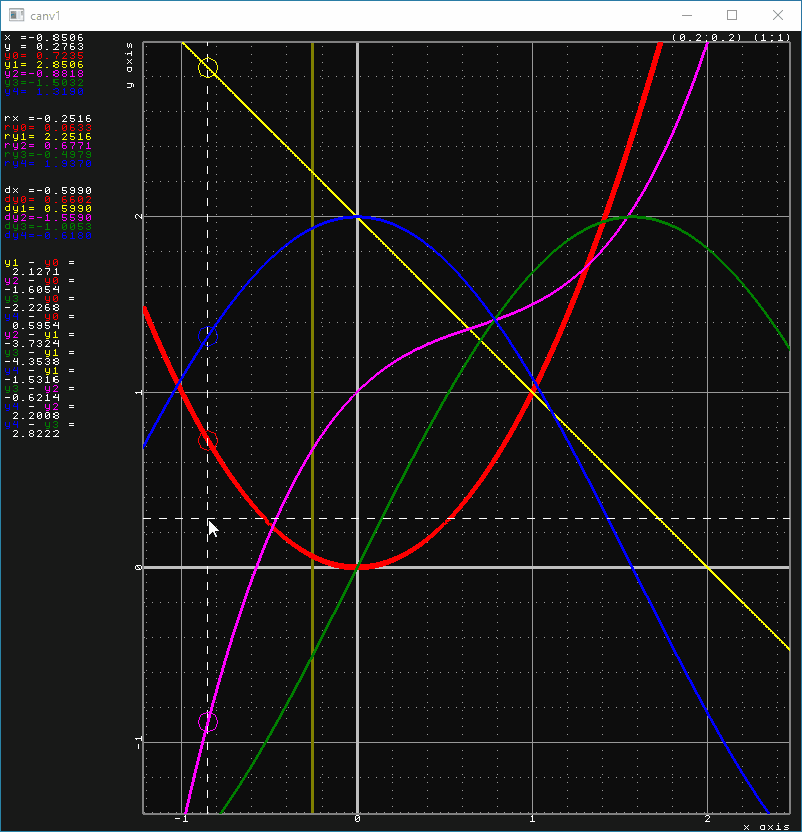
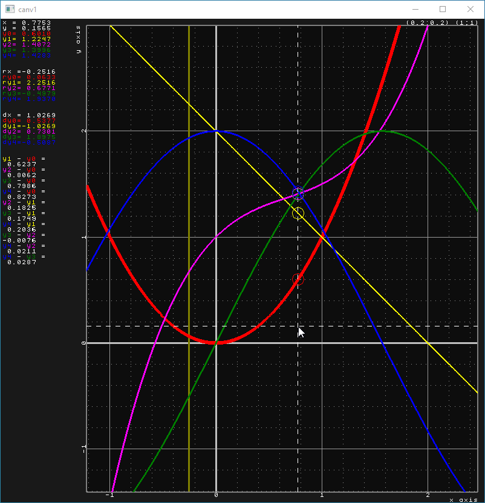
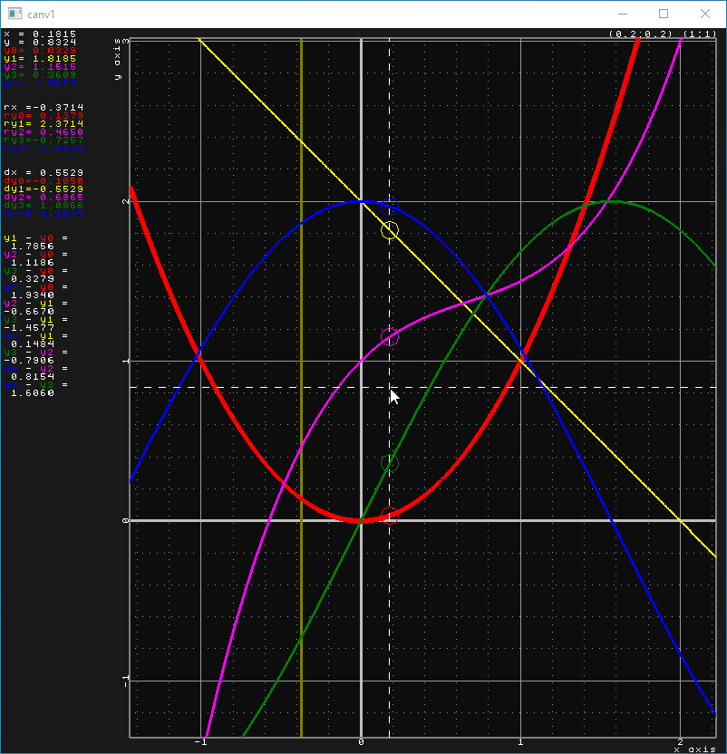
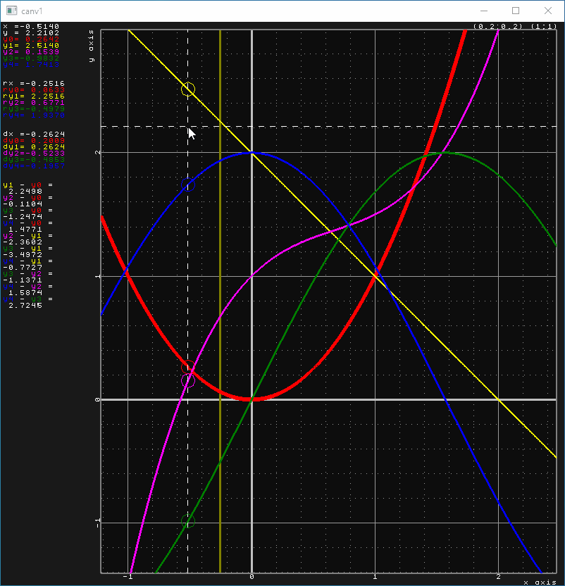
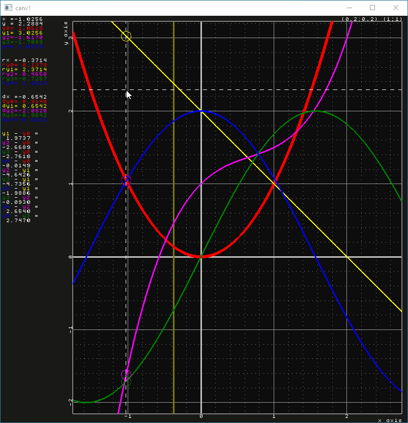
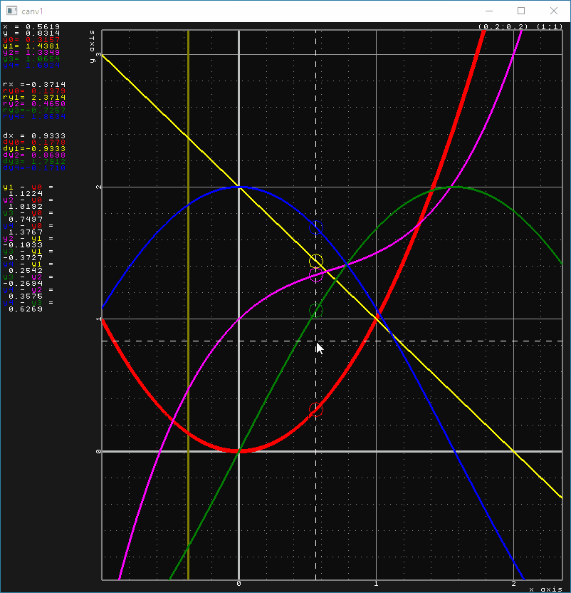
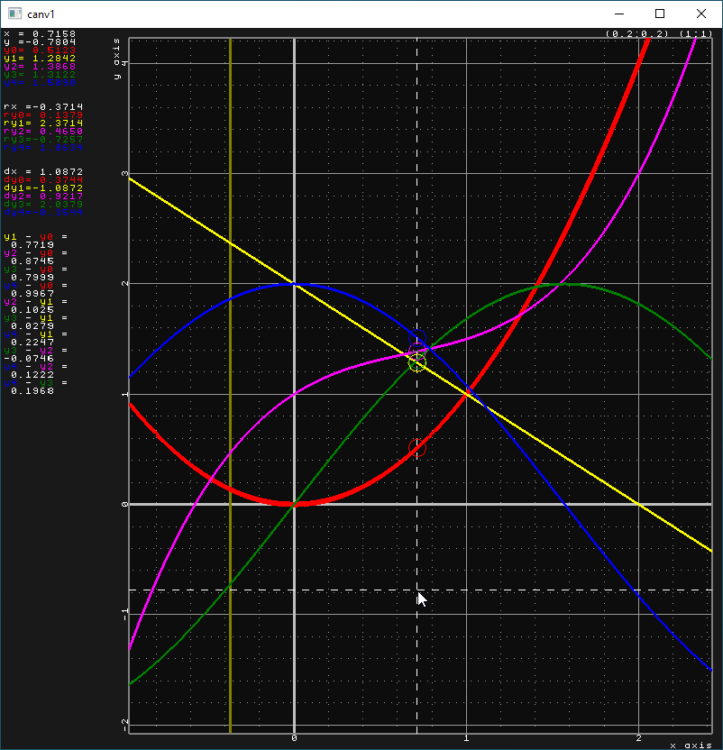

# tiny_graph_plot
Minimalistic OpenGL/GLEW/GLFW-based graph plot tool

Short description
=================

The main goal behind this development is to provide a simple graph (and possibly in the future also histogram) viewing tool which could be easily attached to some **C++** project.
The main "feature" of this particular library is that it has **almost no dependencies**.
**tiny_graph_plot** uses only OpenGL by means of GLEW to draw stuff and GLFW to create a window.
You could hardly go more independent. Plus both of these libraries are included into **tiny_graph_plot**.

The main target audience are the **C++** developers who need to quickly draw some 2d curves while developing some algorithms. I personally came to such a need while working on some Monte-Carlo integration code.

In short, all you need to do is add the header and source files into your project and use the following template to draw your data:

```cpp
#include "tiny_graph_plot.h"
int main(int argc, char** argv) {
    // Example of user code managing the input data
    const int N = 20001;
    Vec2* xy1 = new Vec2[N];
    // Fill xy1 ...

    // You are free to move these lines into your "tiny_graph_plot.h" yourself!
    tiny_graph_plot::GraphManager<float>& graph_manager = global_graph_manager_float;
    tiny_graph_plot::CanvasManager<float>& canvas_manager = global_canvas_manager_float;
    typedef tiny_graph_plot::Graph<float> Graph;
    typedef tiny_graph_plot::Canvas<float> Canvas;
    typedef tiny_graph_plot::Vec2<float> Vec2;

    Graph& gr1 = graph_manager.CreateGraph();
    gr1.SetSharedBuffer(N, xy1);

    Canvas& canv1 = canvas_manager.CreateCanvas("canv1");
    // Optional visual parameters my be set here
    canv1.AddGraph(gr1);
    canv1.Show();

    canvas_manager.WaitForTheWindowsToClose(); // Endless loop

    // Don't forget to clean up :-)
    delete[] xy1;
}
```

A complete example is available [here](source/main.cpp).

Currently only one way of feeding the data into the graph is implemented. You have to manage your `tiny_graph_plot::Vec2<T>` array and supply it to the `tiny_graph_plot::Graph<T>::SetSharedBuffer()` call. Other methods might be implemented later on. For example, I consider implementing the possibility to have the `tiny_graph_plot::Graph<T>` object manage the memory. Another option which I have in mind is similar to how data is supplied to GPU through OpenGL buffers. This would allow the user to build a graph from more or less arbitrary data storage by providing the address offsets. I am open for suggestions!

Of cause, if you are already using GLFW in your project, you will probably have to make some additional actions.

Controls
========

Cursor and reference
--------------------

A number of values are printed in the left part of the window.
This text section consists of 4 blocks:
1. **Current** values under the cursor;
2. **Reference** values;
3. Difference of the **current** values and the **reference** values;
4. All possible differences of the plotted graphs between each other at the **current** cursor position.



The **reference** is selected by *Ctrl* + **left** mouse button clicking at the desired position on the canvas.
The **reference** is drawn as a special thick solid gold line (color and thicknesses are adjustable).



Manipulation
------------

Typical manipulation operations are implemented:
* **Pan** with the **middle** mouse button;
* **Zoom** with the **right** mouse button:
   * no modifier key pressed - zoom with the fixed aspect ratio (move mouse up and down);
   * *Ctlr* key pressed - zoom in X direction only (move mouse left and right);
   * *Shift* key pressed - zoom in Y direction only (move mouse up and down);
   * *Alt* key pressed - zoom with variable aspect ratio.

Zooming using one of the four methods above works such that the point on the canvas at the mouse press stays unmoved.



Another option to zoom in is by performing rectangular selection of an area with the **left** mouse button.



Revert to the previous viewport (a.k.a. undo)
---------------------------------------------

Press **Z** key to undo one manipulation operation. Currently there is no undo stack, so only one such operation is possible.



Fit all in
----------

Press **F** to fit the full range of the plotted graphs into the viewport. This can be also very useful if you have lost your graph while manipulating.



Set aspect ratio to 1
---------------------

Press **S** to set the aspect ratio to one. This means that X and Y axes will have the same scale and the grid will become square.



Canvas settings
===============

A number of canvas visual parameters can be adjusted right after canvas creation in the user code.
These are: axis titles, colors, line thicknesses, window margins, and font size and color.
Important to note, that most of these parameters are read in the Canvas::Show() method to send the corresponsing information to GPU and can not be changed during runtime. Thus, this block should be placed after canvas creation and Canvas::Show() call.

```cpp
    // Optional settings. You can completely omit this section and use default values.
    canv1.SetXaxisTitle("x axis");
    canv1.SetYaxisTitle("y axis", true); // Second argument - rotated by 90deg
    canv1.EnableHgrid();   // canv1.DisableHgrid();
    canv1.EnableVgrid();   // canv1.DisableVgrid();
    canv1.EnableAxes();    // canv1.DisableAxes();
    canv1.EnableVref();    // canv1.DisableVref();
    canv1.EnableFrame();   // canv1.DisableFrame();
    canv1.EnableCursor();  // canv1.DisableCursor();
    canv1.EnableCircles(); // canv1.DisableCircles();

    // Choose the color scheme
    canv1.SetDarkColorScheme(); // canv1.SetBrightColorScheme();
    // Or set individual colors (example values here - dark color scheme)
    canv1.SetBackgroundColor       (tiny_gl_text_renderer::colors::gray1);
    canv1.SetInFrameBackgroundColor(tiny_gl_text_renderer::colors::gray05);
    canv1.SetHGridFineColor  (tiny_gl_text_renderer::colors::gray6);
    canv1.SetVGridFineColor  (tiny_gl_text_renderer::colors::gray6);
    canv1.SetHGridCoarseColor(tiny_gl_text_renderer::colors::gray5);
    canv1.SetVGridCoarseColor(tiny_gl_text_renderer::colors::gray5);
    canv1.SetAxesColor  (tiny_gl_text_renderer::colors::gray75);
    canv1.SetVrefColor  (tiny_gl_text_renderer::colors::olive);
    canv1.SetFrameColor (tiny_gl_text_renderer::colors::gray5);
    canv1.SetCursorColor(tiny_gl_text_renderer::colors::white);
    canv1.SetTextColor  (tiny_gl_text_renderer::colors::white);

    canv1.SetHGridFineLineWidth(1.0f);
    canv1.SetVGridFineLineWidth(1.0f);
    canv1.SetHGridCoarseLineWidth(1.0f);
    canv1.SetVGridCoarseLineWidth(1.0f);
    canv1.SetAxesLineWidth(3.0f);
    canv1.SetVrefLineWidth(3.0f);
    canv1.SetFrameLineWidth(3.0f);
    canv1.SetCursorLineWidth(1.0f);
    canv1.SetCircleRadius(10);
    // Use default font size and corresponding window margins
    //canv1.SetFontSize(1.0f);
    //canv1.SetAllMargins(280, 22, 34, 22);
    // Or use twice as small font and corresponding window margins
    const float font_k = 0.51f;
    canv1.SetFontSize(font_k);
    canv1.SetAllMargins((unsigned int)(font_k * 280), (unsigned int)(font_k * 22),
        (unsigned int)(font_k * 34), (unsigned int)(font_k * 22));
    // End of optional settings
```

Interface
=========

The access to the canvas and graph management is available through the two global variables which can be "renamed" by referencing them in the user code. Also you will most probably need to use three types from the **tiny_graph_plot**, which can be "renamed" to shorten the notation.

This block of code can be positioned either in your `main.cpp` or, if you have already chosen your precision setting, can be moved directly into the "tiny_graph_plot.h". I did not do that for reasons and encourage you to make a decision, comment/uncomment and cut-paste these lines.

```
// Use either this to work with single precision
tiny_graph_plot::GraphManager<float>& graph_manager = global_graph_manager_float;
tiny_graph_plot::CanvasManager<float>& canvas_manager = global_canvas_manager_float;
typedef tiny_graph_plot::Graph<float> Graph;
typedef tiny_graph_plot::Canvas<float> Canvas;
typedef tiny_graph_plot::Vec2<float> Vec2;
// or this to work with double precision
//tiny_graph_plot::GraphManager<double>& graph_manager = global_graph_manager_double;
//tiny_graph_plot::CanvasManager<double>& canvas_manager = global_canvas_manager_double;
//typedef tiny_graph_plot::Graph<double> Graph;
//typedef tiny_graph_plot::Canvas<double> Canvas;
//typedef tiny_graph_plot::Vec2<double> Vec2;
```

Float or Double?
================

**tiny_graph_plot** is written as a template which is intended to be used either with `float` or `double` data type.
If you are not restricted by some already existing code and if you can select, I would recomment to use `float`.
In the end, the graphs are sent to the GPU which anyway operate using single precision floats.

However, if you already have you data in double precision, you can activate the corresponding version of the selector.

Build instructions
==================

**tiny_graph_plot** has been written using MSVS 2019, the project and solution files are included. For MSVS 2019 compiler everything should work smoothly.

However, there is no fancy C++ used in this project, so building under other OS using other compiler should also work, maybe with minor modifications. I plan to introduce official Linux and GCC support soon.

If you are absolutely not familiar how to import external code into you project, please refer to the
[msvs2019_instructions](msvs2019_instructions.md).

Limitations, known issues, bugs, further development
====================================================

One very annoying bug I will be working on as the next step is related to the usage of **tiny_graph_plot** to draw multiple canvases.
For unknown (yet!) reason for me, GLFW hangs if one of the windows is minimized. This is a showstopper at this point which makes the usage of **tiny_graph_plot** with multiple canvases very inconvenient.

Related to that is another problem which is that the 'Esc' key keyboard event is only processed by the very first window. You can only terminate GLFW by closing the first window or, which is equivalent, by pressing 'Esc' key when the focus is on the first window.

One serious limitation is that you can not infinitely zoom in or zoom out. At some point the image becomse glitchy. And the reason for that is pretty obvious. The GPU which draws everything works with single precision floating point numbers. These have quite a limited precision and you can easily hit their limits. This, however, can be fixed with a bunch of "hacks" (not really hacks, just clever tricks).
Thus, if by some chance you tried to use **tiny_graph_plot** and you face the precision limitation and you're reading these lines (so many conditions!), please, contact me. I will adjust the code for your use case, make a summary and probably implement this improvement as a feature.
On the other hand I've put some checks trying to avoid the crash or any kind of dead end state. Thus, if your manipulation is stuck (or smth), just press **F** to "fit all in". If this did not work, sorry, you have to start over.

There are some minor "features" which are obvious due to the limited scope of **tiny_graph_plot**. I never intended to write a perfect graph rendering software, but more focus on a minimalistic tool which will do the job. Thus, some text may overlap or not fit into the window, or whatever. Having such problems fixed is not worth the number of lines of code to be spent.

As one of the next steps I plan to implement histograms, mainly because this is a very desired feature with many use-cases and also because it does not seem to be a big development taking into account the current state of the code.
