Detailed instructions on how to include **tiny_graph_plot** into your MSVS project
==================================================================================

A very common procedure of attaching some third-party code into your MSVS code is described here.
You should probably be already familiar with it.
But if not, if you are a complete novice, or just curious about how other people do it, here are the steps.

Create a new project or open your existng project into which you want the intergrate the third-party code.
I have created a new project here. Most importantly, Visual Studio creates a solution file and a project file for me.
Depending on what you have specified, these two files might be either in the same directory or
the project file may be under another directory one level deeper.
These two directories, same or different, can be referred to from the the project settings using the
environment variables `$(SolutionDir)` and `$(ProjectDir)`.

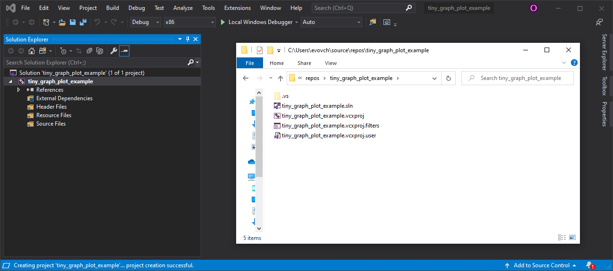

Inside your solution directory create a dedicated directory for third-party libraries.
Inside it place the GLEW and GLFW directories and the yet empty tiny_graph_plot.
The GLEW and GLFW can be either copied from the tiny_graph_plot distribution or you can directly get them from
GLEW and GLFW original repositories. Note, however, that we don't need the full source here, which is downloaded
if you clone the corresponding GitHub repos. Only the headers and dynamic libraries (`.h`,`.dll`,`.lib` files) are needed.
Moreover, the source actually does not contain the pre-build version,
which is why you might want to search for them on the Internet or just take them from here.

For example, both GLEW and GLFW are distributed both as source and as binaries:
see [here](http://glew.sourceforge.net/) and
[here](https://www.glfw.org/download.html).

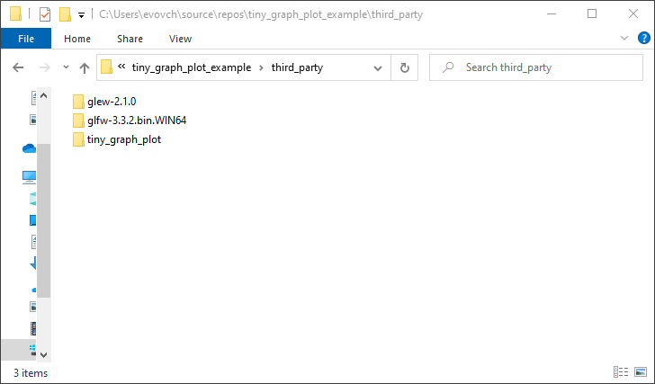

Fill the `third_party/tiny_graph_plot/` directory by copying the `include/` and `source/` directories from this repository.
You don't need anything else.

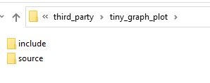

Now it is time to include the headers/source files right into your project.
They will be compiled together with your code.
It might seem to be an overhead or potential name collision source,
but really there is not much code added to your project and everything is hidden into the `tiny_graph_plot` namespace.
Again, the target audience are the developers, who might want to adjust something to their needs.

If you are using filters, I suggest putting the included files into the dedicated filters.

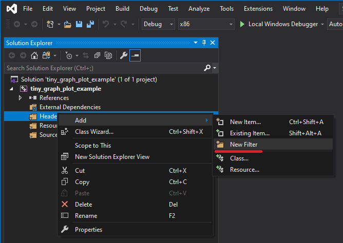
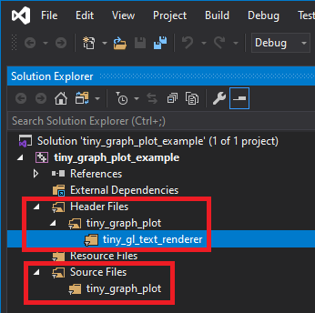
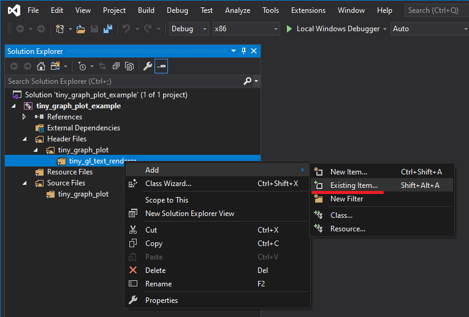

This is how your project might look when all the files are included.
Note that the `main.cpp` from the distribution can be used for testing,
but most probably you will want to write your own main function.
Thus it should not be under the tiny_graph_plot filter.

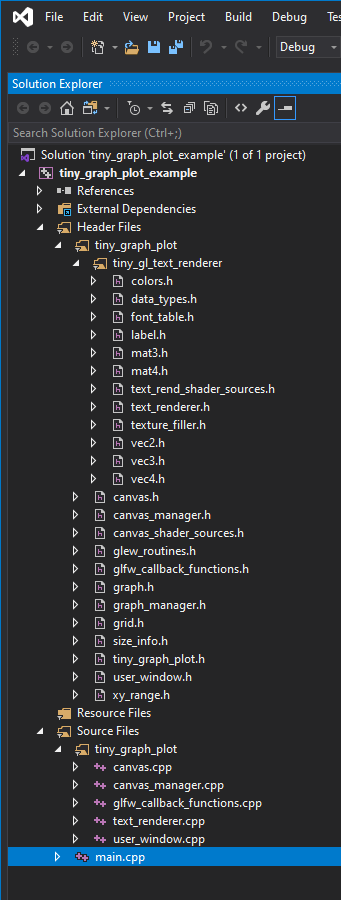

The third-party `include/` and `lib/` directories should be added to the search lists of the project.
Note that these settings are applied to different build configurations separately - `Debug`/`Release`, `x86`/`x64`.
So, note which one you are configuring and which one you are actually using.
I usually configure both `Debug` and `Release` at once, cause in a more or less serious development you often switch between them.

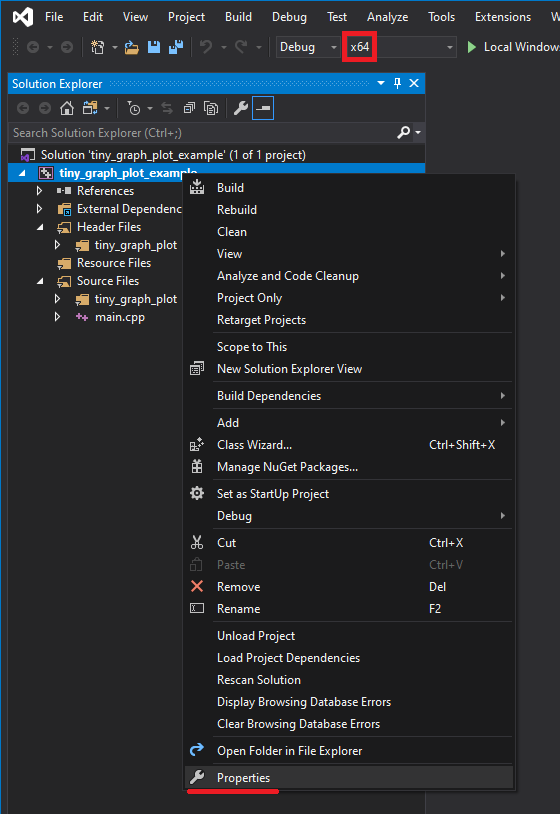

In the left section locate `Configuration Properties -> VC++ Directories`, then

Include Directories:

```
$(SolutionDir)\third_party\glew-2.1.0\include\
$(SolutionDir)\third_party\glfw-3.3.2.bin.WIN64\include\
$(SolutionDir)\third_party\tiny_graph_plot\include\
```

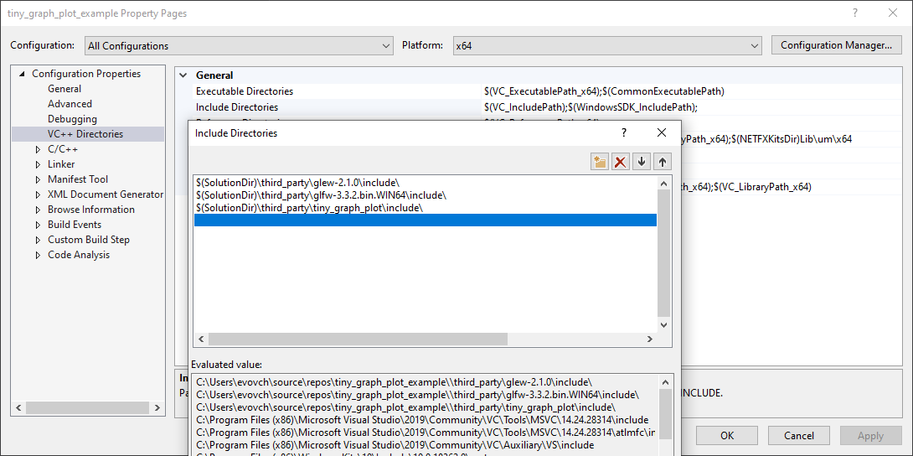

Library Directories:

```
$(SolutionDir)\third_party\glew-2.1.0\lib\Release\x64\
$(SolutionDir)\third_party\glfw-3.3.2.bin.WIN64\lib-vc2019\
```

Note that due to the fact that tiny_graph_plot is distributed as source code and not compiled binaries,
you don't need to have anything about tiny_graph_plot in this list.

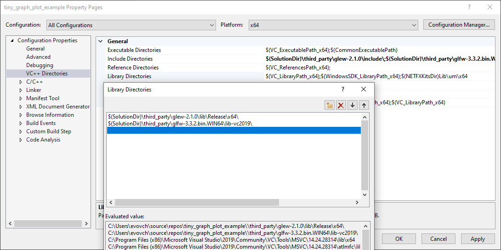

In the left section locate `Configuration Properties -> Linker -> Input`, then

Additional Dependencies:

```
glfw3.lib
glew32.lib
opengl32.lib
```

Note that `opengl32.lib` must be added here because GLEW uses OpenGL.
In most cases the `opengl32.lib` file is present in your OS.

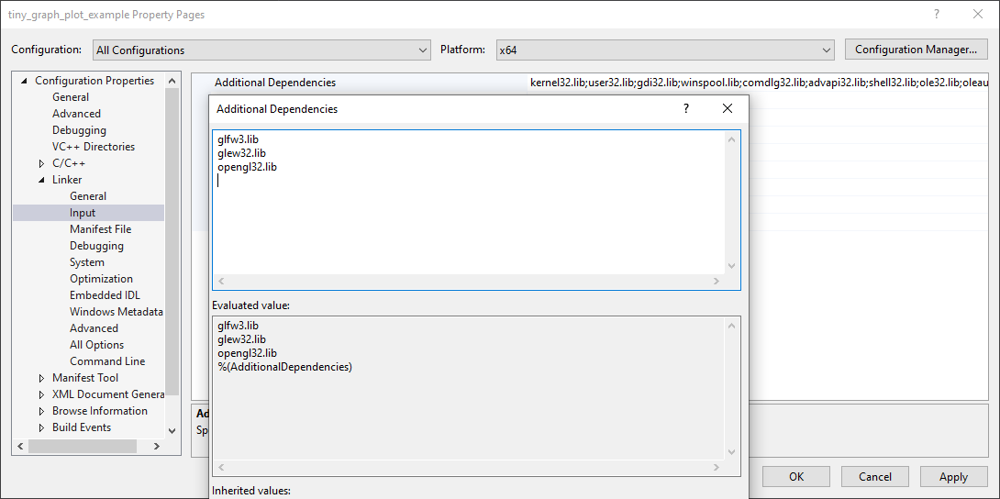

At this point it should be possible to build the project without errors.
However if you try to run you will most probably hit the following message.

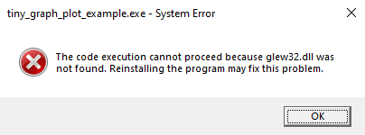

Pointing to the `.lib` file is not enough, it does not contain all the necessary binary code,
only a table needed to run the code in the `.dll` file.
There is a number of ways to point to the `.dll` file, but the most simple one is just to place it right next
to the executable which you run.

To do so, locate the build directory which is created by MSVS when you run the build.
Unless you have configured differently, it is located in the solution directory and is called `x86/` or `x64/`.
Inside you will have `Debug`/ and/or `Release/` directories depending on how you have built the project.
Note that these directories are created when you build the project, so if you can not see them, try to build!

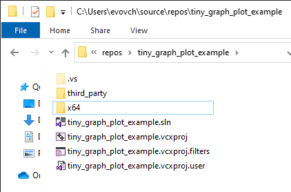

So, as the last step, copy the `glew32.dll` and `glfw3.dll` files from where you took GLEW and GLFW
into your build directory. The `.dll` files are usually located in the `bin/` directory.


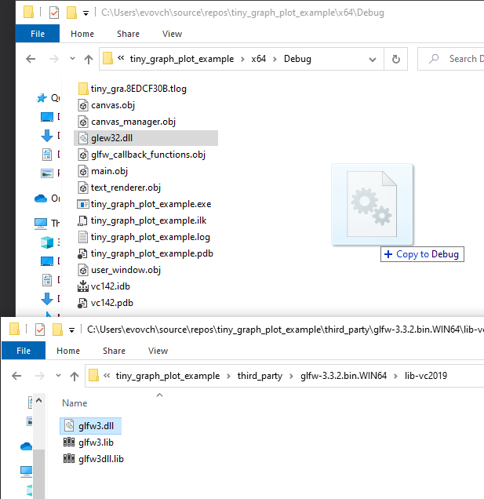

That's it. You should be able to run your project!
